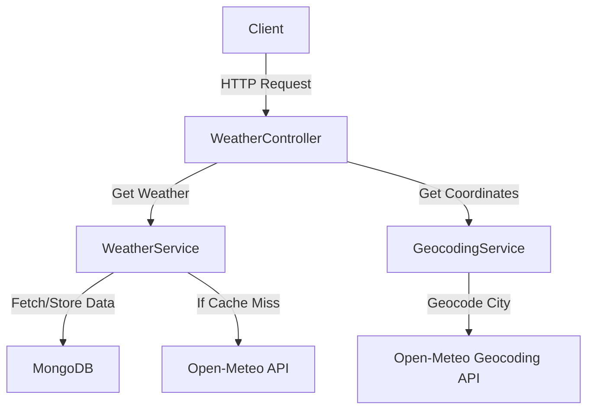

# Weather Service API

This API provides weather information based on coordinates or city names, with data caching for improved performance.

## Architecture

Weather Service API follows a layered architecture:

1. Controllers: Handle incoming HTTP requests
2. Services: Contain business logic and external API interactions
3. Data Access: Manages data persistence using MongoDB

Key components:
- WeatherController: Exposes API endpoints
- WeatherService: Fetches and caches weather data
- GeocodingService: Converts city names to coordinates
- MongoDB: Stores cached weather data

## How to Run in Visual Studio

1. Clone the repository
2. Open the solution file in Visual Studio
3. Restore NuGet packages
4. Ensure MongoDB is installed and running locally
5. Update the connection string in `appsettings.json` if necessary
6. Press F5 or click the "Run" button to start the API
7. The Swagger UI will open in your browser, allowing you to test the endpoints

## API Endpoints

1. GET /api/weather/coordinates
    - Parameters: latitude, longitude
    - Returns weather data for the given coordinates

2. GET /api/weather/city
    - Parameters: city
    - Returns weather data for the given city name

## Caching Strategy

The API caches weather data in MongoDB to reduce external API calls and improve response times. Cached data is considered valid for one hour.

## Error Handling

The API uses built-in .NET exception handling middleware. Errors are logged using Serilog and appropriate HTTP status codes are returned to the client.

## Logging

Serilog is used for structured logging. Logs are configured in `appsettings.json` and can be directed to various sinks (console, file, etc.).

## API Documentation

Swagger UI is available in the development environment. Access it by running the API and navigating to `/swagger` in your browser.